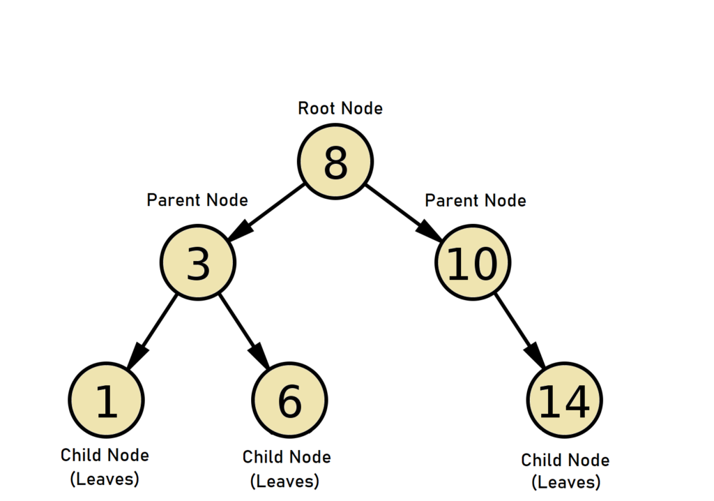

# Tree
Another type of the python data stuctures is known us `Tree`. Yes tree. Consider a tree in real life; It has a root which is deep rooted in the soil. From this root, grows the stem, then the branches and leaves. In python, a tree is a type of data structure where items are arranged hierachically and connected through nodes. Every tree has a root node just like a normal tree has a root. And each node can have zero or more nodes connected to it by pointers. You can call these subnodes or the leaves. Trees are similar to linked lists which we will cover in another tutorial.
An example of a tree below.



 ## Types
 - Binary Tree: A binary tree is the type in which each node in the tree can have a maximum of only two subnodes. What this means is that, each node in the tree can only grow up t0 two branches(nodes). These branches are called the child nodes. 
 ```
 An example of a binary tree
                 10 <-----root node
                /  \
               11   6<-------- Parent node
              / \  / \
leaf ------->5    2   3 <----------- child node
node
```
 ```python
 #initializing a binary tree
 class BinaryTreeNode:
    def __init__(self, data):
        self.data = data
        self.leftNode = None
        self.rightNode = None
```
 - Binary Search Tree: A data structure in which each node is greater than its left child nodes and less than its right child nodes and all nodes of the right child are greater than the root node. This property allows us to quickly maintain a sorted list of items. We say binary `search` tree because it can be used to search for membership of an item in O(log(n)) time. Let's to create a BST with these numbers, `[20, 8, 16, 21, 30, 15, 25]` with 20 as the root:
 ```
 An example of Binary search tree
               20
              /   \
            15     30
            /\      \
           8 16      33
             /       /
            18      25
                
 ```
 - Balanced Binary Search Tree: This is a search tree in which the height of any two subtrees are equal or less than 2. The number of nodes in the tree gives us the height. Note that the balnced search tree gives us perfomance of O(log(n)). However, the unbalanced BST will give us a best performance of O(n). This is because the unblanced tree is most often linear. Various functions in a BST often requires the use of recursion to get results. we will have to call the same function in the code to our results.
 The example above is a balanced binary search tree because the difference in heights of the 2 subtrees is 0.
````
               20
                \
                28
                 \
                  23
                   \ 
                   15
                    \
                    10
This tree is not a balanced BST and will there give a performance of O(n) when used to search a number.
````
## Common Terms Associated with Trees
- Root Node: This is where the nodes start connecting from. We can say it is the parent of the first parent nodes.
- Parent Node: A node that connects directly to the child nodes
- Child Node: A node that is directly connected from the parent node
- Leaf Node: A node that does not have any child nodes

## Example Code: Insert a value in the Binary Tree
```python
class BinarySearchTree:
    def __init__(self, data):
        self.left = None
        self.right = None
        self.data = data

    def insert(self, data):
        #before we insert a value, we compare it to the parent node
        # which in this case is the root node.
        if self.data:
            if data < self.data:
                if self.left is None:
                    self.left = BinarySearchTree(data)
                else:
                    self.left.insert(data)
            elif data > self.data:
                if self.right is None:
                    self.right = BinarySearchTree(data)
                else: 
                    self.right.insert(data)
        else:
            self.data = data
    #we need to create a function to print the nodes
    def PrintTree(self):
        if self.left:
            self.left.PrintTree()
        print(self.data)
        if self.right:
            self.right.PrintTree()
#now let's add some numbers and display them
BST = BinarySearchTree(18)
BST.insert(6)
BST.insert(15)
BST.insert(11)
BST.insert(3)
BST.PrintTree()
```
````
Output: 3 6 11 15 18
````

# Problem To Solve: Traverse forward in a BST
Write a python code to traverse forward through a binary search tree and append all the nodes into an array.
NOTE: There are different ways to solve this problem but te results should be similar.

Check the [solution](3-solution.py) only after you have made an attempt to solve the problem on your own.

[Back to Welcome Page](welcome.md)
